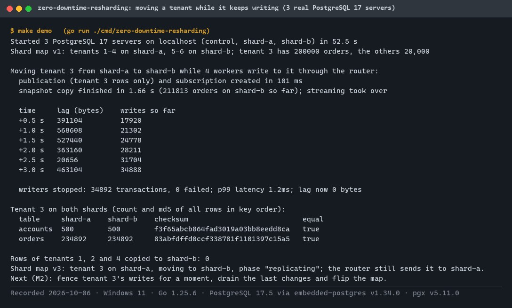
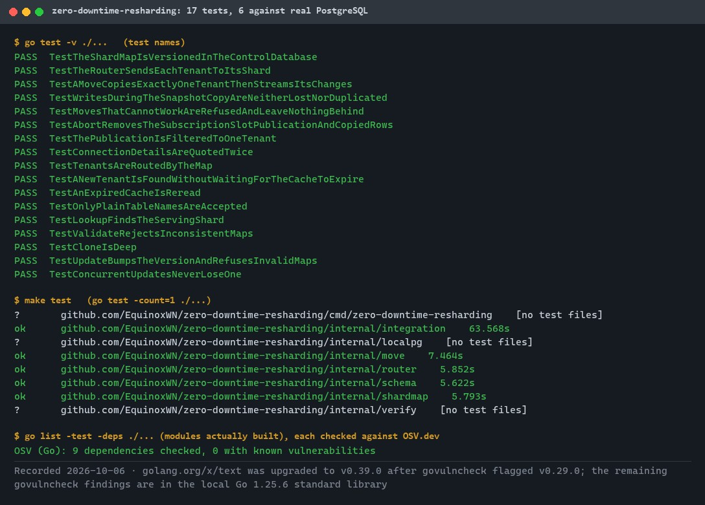
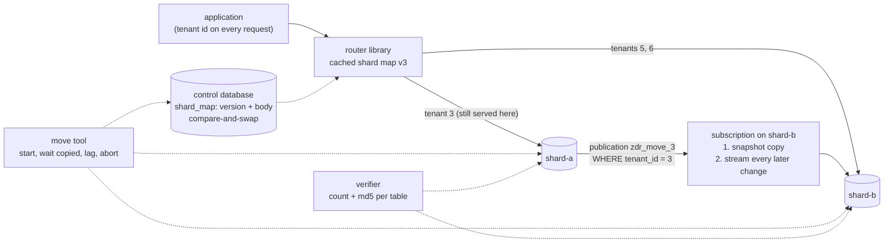
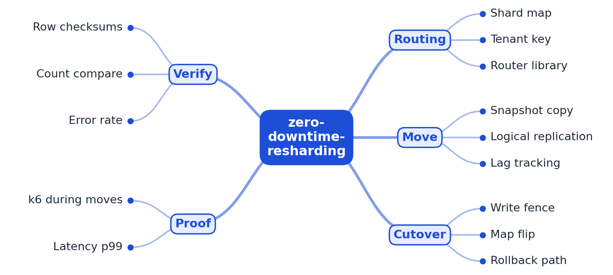
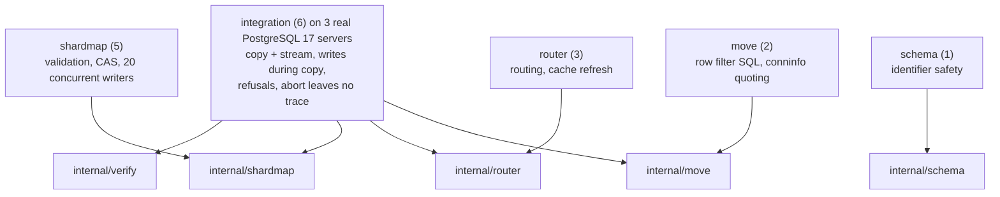

# zero-downtime-resharding

[](https://github.com/EquinoxWN/zero-downtime-resharding/actions/workflows/ci.yml)


> The database no longer fits one machine, step one: copy a tenant to another shard while it keeps taking writes, with PostgreSQL logical replication keeping the copy in sync and checksums proving both sides match.

Part of my **Backend and API** list · Go · core project

> Builds on: [multi-tenant-saas-core](https://github.com/EquinoxWN/multi-tenant-saas-core)

## Proof it works

Three real PostgreSQL 17 servers start on localhost (a control database and two shards). Tenant 3, with 200,000 orders, is copied from shard-a to shard-b and kept in sync by logical replication while four workers keep writing to it through the router: about 35,000 transactions, none failed, p99 1.2 ms. Afterwards both copies match by row count and checksum, and no other tenant's rows reached the target. Switching the tenant's traffic to shard-b (the cutover) is M2:



17 tests pass, 6 of them against the real servers (including about 7,500 concurrent transactions during a copy), and every compiled dependency is free of known vulnerabilities:



## Architecture

**What M1 runs today:**



**Full roadmap (M1 to M3):**



## How it works

_Steps 1 and 2 are built and tested (M1); the rest is on the [roadmap](#roadmap)._

1. Every request carries a tenant key, and a router library looks up that tenant's shard in a versioned shard map.
2. To move a tenant, the tool copies a snapshot of its rows to the target shard and starts logical replication to stream new changes.
3. When replication lag is near zero, that tenant's writes are fenced for a few hundred milliseconds, the last changes drain, and the shard map flips.
4. Clients retry fenced writes automatically, so users see a brief latency blip instead of errors.
5. Before old data is deleted, a checker compares row counts and checksums on both shards; any mismatch rolls the map back.
6. k6 runs load during every move, recording error rate and p99 latency.

## Tech stack

| Area | In M1 | Planned |
|---|---|---|
| Core | Go, pgx, several PostgreSQL 17 shards, versioned shard map with compare-and-swap | - |
| Move | Snapshot copy and logical replication, checksum verifier, rollback on failure | Short write fence and map flip at cutover, client retries |
| Test | Real PostgreSQL servers (embedded-postgres), concurrent writers during a copy | k6 load during every move, Testcontainers |

Language: **Go** (1.25+). Code in [`internal/`](internal): `shardmap` (versioned map, compare-and-swap, PostgreSQL store), `router`, `move` (publication, subscription, lag, abort), `verify`, `schema`, and `localpg` (starts real PostgreSQL servers for tests and the demo); the demo is [`cmd/zero-downtime-resharding`](cmd/zero-downtime-resharding).

## Run it

**Prerequisites:** Go 1.25+. No Docker: the tests and the demo start real PostgreSQL 17 servers on localhost with embedded-postgres, which downloads the binaries once (about 25 MB) into `.tmp/pg/cache`.

```bash
make setup   # download modules
make lint    # gofmt and go vet
make test    # 17 tests; the integration tests start a control database and two shards
make demo    # move a 200,000-order tenant while four workers keep writing to it
make audit   # govulncheck
```

`go test -short ./...` runs only the unit tests (no PostgreSQL).

### The phases of a move

| Phase | Served by | What is happening |
|---|---|---|
| stable | its shard | nothing |
| copying | source | the subscription copies a consistent snapshot of the tenant's rows |
| replicating | source | every change committed after the snapshot streams to the target; lag is measured in WAL bytes |
| fenced, flipped (M2) | target | writes pause for a moment, the last changes drain, the map flips |

## Tests and results

Full numbers, the injected-bug checks and the demo output: [docs/results/m1.md](docs/results/m1.md).

| Check | Result |
|---|---|
| Tests (`make test`) | **17 passed**, 0 failed, 6 of them against three real PostgreSQL 17 servers |
| Writes during a move | about 7,500 transactions (test) and 35,000 (demo) committed during the copy and stream: none failed, none lost, none duplicated; p99 1.2 ms |
| Exactly one tenant | equal row counts and md5 checksums for the moved tenant on both shards; no row of another tenant reaches the target |
| Copy and lag | 200,000 orders copied in 1.7 s; lag 20 to 570 KB of WAL under about 7,000 transactions per second, 0 bytes once writes stop |
| Unsafe moves refused | unknown tenant or shard, same shard, a second move, and a target already holding the tenant are refused and leave nothing behind |
| Do the tests catch bugs? | removing the row filter or the snapshot copy makes the integration tests fail |
| Lint / audit | gofmt and go vet clean; govulncheck found one vulnerable dependency (`golang.org/x/text` v0.29.0), now upgraded |

### Test map



## Roadmap

**M1** (≈15 h)
- [x] Write `docs/rfc/0001-design.md`: problem, goals, non-goals, chosen design
- [x] Every request carries a tenant key, and a router library looks up that tenant's shard in a versioned shard map.
- [x] To move a tenant, the tool copies a snapshot of its rows to the target shard and starts logical replication to stream new changes.

**M2** (≈20 h)
- [ ] When replication lag is near zero, that tenant's writes are fenced for a few hundred milliseconds, the last changes drain, and the shard map flips.
- [ ] Clients retry fenced writes automatically, so users see a brief latency blip instead of errors.

**M3** (≈25 h)
- [ ] Before old data is deleted, a checker compares row counts and checksums on both shards; any mismatch rolls the map back.
- [ ] k6 runs load during every move, recording error rate and p99 latency.
- [ ] Publish the proof below with real numbers

## Proof

What this repo must show before it counts as done:

- A large tenant moved under load with zero errors, the measured fence duration, and the checksum report.

| Result | Value |
|---|---|
| M3 proof above | Not measured yet (M3). Current M1 numbers: see [Tests and results](#tests-and-results). |

## Why it matters

- **Interview angle:** 'The database no longer fits one machine: shard it with no downtime'.
- **Upstream I'd like to contribute to:** Vitess (from YouTube): resharding workflows.

## Design docs

- [RFC 0001: design](docs/rfc/0001-design.md)
- [ADR 0001: record architecture decisions](docs/adr/0001-record-architecture-decisions.md)
- [ADR 0002: per-tenant logical replication](docs/adr/0002-per-tenant-logical-replication.md)
- [ADR 0003: versioned shard map with compare-and-swap](docs/adr/0003-versioned-shard-map-with-compare-and-swap.md)
- [M1 results](docs/results/m1.md)

## Scope

This is a learning and portfolio system, not a hosted production service. Everything runs locally.

## Security and contributing

- Every GitHub Action is pinned to a commit SHA; workflows run read-only, without persisted credentials.
- Dependabot proposes dependency and action updates weekly.
- Tenant ids are integers and table names must be plain identifiers before they reach SQL; connection details are quoted twice in `CREATE SUBSCRIPTION`; test servers listen on localhost only with a password made up per run; CI runs `govulncheck` on every push.
- Report vulnerabilities privately: see [SECURITY.md](SECURITY.md). To contribute, see [CONTRIBUTING.md](CONTRIBUTING.md).

## License

MIT, see [LICENSE](LICENSE).
